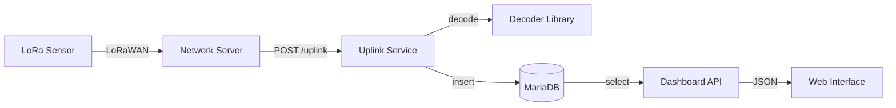

# LoRaSense: Technische Projektdokumentation

## 1. Projektüberblick

### Zweck und Ziel
**LoRaSense** ist eine End-to-End-IoT-Plattform zur Erfassung, Dekodierung und Visualisierung von Sensordaten über das LoRaWAN-Protokoll. Das Hauptziel ist die Bereitstellung eines zentralen Dashboards für Umwelt- und Sensordaten (z. B. Wetterstationen), das sowohl Rohdaten speichert als auch physikalisch interpretierbare Werte anzeigt.

### Welches Problem wird gelöst?
LoRaWAN-Sensoren senden Daten oft in kompakten, binären Payloads (Base64), die für Endanwender unlesbar sind. LoRaSense schließt die Lücke zwischen dem Netzwerk-Server (z. B. The Things Network) und dem Endanwender, indem es:
1. Payloads empfängt.
2. Herstellerspezifische binäre Daten in lesbare JSON-Objekte dekodiert.
3. Nutzerbasierte Berechtigungen für verschiedene Sensoren verwaltet.
4. Historische Daten für Analysen und CSV-Exporte bereitstellt.

### Zielgruppe
- **Umweltforscher & Landwirte**: Zur Überwachung von Wetterstationen (z. B. Barani MeteoHelix).
- **Systemadministratoren**: Zur Verwaltung von LoRaWAN-Sensorflotten.
- **Entwickler**: Die eine Basis für eigene IoT-Anwendungen suchen.

### Gesamtarchitektur
Das System basiert auf einer **Microservices-Architektur**, die in Docker-Containern isoliert ist:
- **Uplink Service**: Ingestion-Layer (Datenempfang).
- **Dashboard Service**: UI- und API-Layer (Präsentation).
- **Database (MariaDB)**: Persistence-Layer.
- **Common Logic**: Gemeinsame Bibliothek für Dekodierung und DB-Zugriff.

---

## 2. Ordner- und Dateistruktur

### Root-Verzeichnis
- `docker-compose.yml`: Das Herzstück der Infrastruktur. Es definiert drei Services (`db`, `uplink`, `dashboard`) und ein Management-Tool (`phpmyadmin`). Es regelt Netzwerke, persistente Volumes für die Datenbank und mappt Ports (z.B. 8080 für das Dashboard).
- `.env`: Eine Konfigurationsdatei für sensible Daten. Sie trennt Geheimnisse (Passwörter, API-Keys) vom Code, was eine Grundvoraussetzung für sichere Softwareentwicklung ist.
- `.gitignore`: Verhindert, dass temporäre Dateien (wie `__pycache__`) oder sensible Daten (`.env`) in die Versionsverwaltung gelangen.
- `LICENSE`: Dokumentiert die rechtlichen Rahmenbedingungen (hier MIT).

### `common/` (Geteilte Logik - "Single Source of Truth")
- `database.py`: Enthält die gesamte SQL-Logik. Sie stellt die Verbindung mit Retry-Logik her (wichtig, da Container unterschiedlich schnell starten) und definiert das Schema. Durch die Auslagerung in `common` nutzen sowohl der `uplink` (Schreiben) als auch das `dashboard` (Lesen) dieselbe Logik, was Inkonsistenzen verhindert.
- `decoder.py`: Beinhaltet die fachliche Logik zur Interpretation der binären Sensordaten. Durch das Factory-Pattern können hier neue Sensortypen hinzugefügt werden, ohne den restlichen Code zu verändern (Open-Closed-Prinzip).

### `services/uplink/` (Ingestion Layer)
- `Dockerfile`: Ein minimalistisches Python-Image. Es installiert Abhängigkeiten (`flask`, `mysql-connector-python`) und startet den Dienst.
- `src/uplink_app.py`: Der Einstiegspunkt für Daten. Die einzige Aufgabe ist es, HTTP-Requests anzunehmen, den Dekoder aufzurufen und das Ergebnis in die DB zu persistieren.

### `services/dashboard/` (Präsentations & Management Layer)
- `Dockerfile`: Ähnlich wie beim Uplink, jedoch optimiert für den Dashboard-Betrieb mit Volumen-Mounts für die Entwicklung.
- `src/dashboard_app.py`: Der umfangreichste Dienst. Er verwaltet Routen für die Benutzeroberfläche, die REST-API für die Datenvisualisierung und die gesamte Admin-Logik (User-Management, Sensor-Zuweisung).
- `src/lorasense.db`: (Optional/Legacy) Ein Überbleibsel aus einer SQLite-Entwicklungsphase, im Produktivbetrieb durch MariaDB ersetzt.
- `website/`: Das statische Frontend.
  - `index.html`: Die Hauptseite. Sie ist modular aufgebaut und lädt CSS/JS-Ressourcen.
  - `css/main.css`: Definiert das visuelle Design (Theming).
  - `js/app.js`: Die Client-seitige Logik. Sie macht AJAX-Calls an die API, aktualisiert die Charts und steuert die Modals.
  - `partials/`: HTML-Schnipsel für Kopfzeilen, Fußzeilen oder komplexe UI-Elemente wie das User-Management-Panel.

### `tests/` (Qualitätssicherung)
- `test_decoder.py`: Unit-Tests, die sicherstellen, dass die mathematische Umrechnung der Payloads korrekt ist.
- `verify_login_security.py`: Integrationstest für die Sicherheitsmechanismen der Authentifizierung.
- `verify_mvp.py`: Ein Ende-zu-Ende Test, der den gesamten Datenfluss simuliert.

### `scripts/` (Automatisierung & Simulation)
- `simulate_sensor.py`: Ein Tool, das so tut, als wäre es ein LoRa-Netzwerk-Server. Enorm wichtig für die Entwicklung ohne echte Hardware.
- `import_barani_data.py`: Ein Skript für Migrations-Szenarien, um Altdaten aus CSV-Dateien in die Datenbank zu laden.
- `delete_mocks.py`: Bereinigt die Datenbank von Testdaten.

---

## 3. Zentrale Komponenten

### 1. Uplink-Service (`uplink_app.py`)
- **Verantwortung**: Empfängt verschlüsselte/kodierte Nachrichten von LoRa-Gateways.
- **Abhängigkeit**: Nutzt `common.decoder` zur Interpretation und `common.database` zum Speichern.

### 2. Decoder-Factory (`decoder.py`)
- **Verantwortung**: Wandelt binäre Hex-Strings/Base64 in physikalische Einheiten (Temperatur, Feuchtigkeit etc.) um.
- **Wichtig**: Nutzt Bit-Shifting gemäß Herstellerspezifikationen.

### 3. Dashboard-Service (`dashboard_app.py`)
- **Verantwortung**: Authentifizierung (Flask-Session), Benutzerverwaltung und Datenbereitstellung für das Frontend über eine REST-API.
- **Datenfluss**: Fragt die MariaDB ab und liefert JSON an den Browser.

---

## 4. Datenfluss & Logik

1. **Eingang**: Ein Sensor sendet ein Paket. Der Netzwerk-Server leitet es als JSON (mit Base64-Payload) an den `/uplink`-Endpunkt weiter.
2. **Dekodierung**: Der Uplink-Service identifiziert den Sensor via `dev_eui`, lädt das passende Dekoder-Profil und rechnet die Bits in Zahlen um.
3. **Speicherung**: Sowohl die Rohdaten als auch die dekodierten Werte landen in der Tabelle `sensor_data`.
4. **Visualisierung**: Das Frontend fragt regelmäßig `/api/sensors` ab. Die API filtert dabei nach den Berechtigungen des eingeloggten Nutzers.

---

## 5. Technische Details

- **Frameworks**: Flask (Backend), Chart.js (Visualisierung).
- **Datenbank**: MariaDB (relational, performant für Zeitreihen-Metadaten).
- **Authentifizierung**: Werkzeug `password_hash` für Sicherheit; Flask Sessions für Zustandsverwaltung.
- **Kommunikation**: Alle Dienste kommunizieren über das interne Docker-Netzwerk.

---

## 6. Typische Abläufe (Use Cases)

### Szenario: Start der Anwendung
1. Docker Compose startet MariaDB.
2. Dashboard wartet, bis die DB bereit ist (`healthcheck`).
3. `database.init_db()` prüft, ob Tabellen existieren und führt ggf. Migrations oder Seeding (Standard-Admin) durch.

### Szenario: Neuer Sensor-Wert
1. POST an `/uplink`.
2. `uplink_app` prüft `devices`-Tabelle auf existierende Konfiguration.
3. Dekoder extrahiert Werte (z. B. Temp: 22.5°C).
4. Speicherung in `sensor_data`.
5. Dashboard-Nutzer sieht den neuen Wert nach dem nächsten automatischen Refresh.

---

## 7. Erweiterbarkeit & Wartung

### Neue Sensoren hinzufügen
Einfach eine neue Klasse in `common/decoder.py` von `BaseDecoder` ableiten und in die `DecoderFactory` eintragen. Das System erkennt den neuen Typ automatisch anhand der Datenbankkonfiguration (`sensor_types`).

### Wartungspunkte
- **Datenbank-Wachstum**: Bei vielen Sensoren sollte über eine Partitionierung der `sensor_data`-Tabelle nachgedacht werden.
- **Sicherheit**: Die `.env`-Datei darf niemals in die Versionsverwaltung (Git) gelangen.

---

## 8. Zusammenfassung & Empfehlungen

### Fazit
LoRaSense ist eine solide, modulare Basis für IoT-Projekte. Die Trennung von Uplink und Dashboard sorgt für Skalierbarkeit (z. B. mehrere Uplink-Instanzen bei hoher Last).

### Verbesserungsvorschläge (Senior-Architekt-Sicht)
1. **Asynchrone Verarbeitung**: Nutzen Sie **Redis/Celery** für die Dekodierung, falls tausende Nachrichten pro Sekunde eintreffen.
2. **TimeSeries DB**: Für extrem große Datenmengen wäre **InfluxDB** oder **TimescaleDB** für die `sensor_data` effizienter als MariaDB.
3. **Frontend Refactoring**: Das aktuelle `index.html` ist sehr groß. Ein Wechsel auf ein Komponenten-Framework wie **Vue.js** oder **React** würde die Wartbarkeit des Frontends erhöhen.
4. **API-Dokumentation**: Integration von **Swagger/OpenAPI** würde die Anbindung externer Tools erleichtern.
