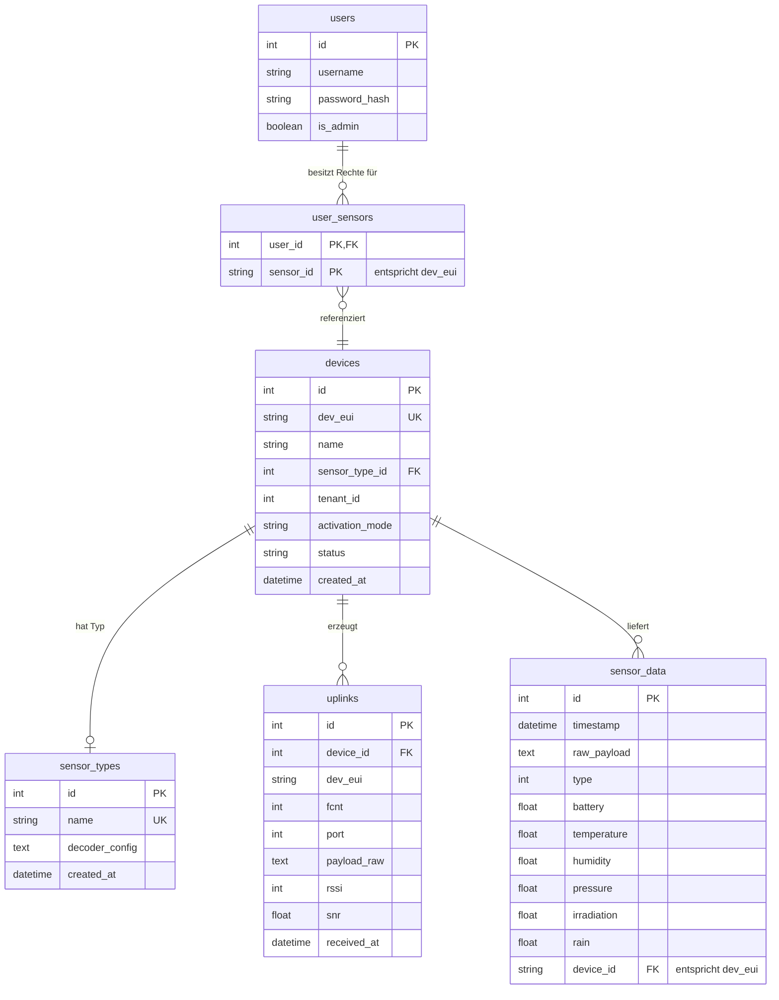

# Datenbank-Struktur LoRaSense

Dieses Dokument beschreibt die Tabellenstruktur der LoRaSense-Datenbank. Das System verwendet primär **MariaDB** (Produktion) mit einem automatischen Fallback auf **SQLite** (`storage/data/lorasense_fallback.db`), falls MariaDB nicht erreichbar ist.

## Entity Relationship Diagramm (ERD)

## Tabellen-Details

### 1. `devices` (Geräteregistrierung)
Speichert alle registrierten LoRaWAN-Endgeräte.

| Spalte | Typ | Beschreibung |
| :--- | :--- | :--- |
| `id` | INT | Primärschlüssel (Auto-Increment). |
| `dev_eui` | VARCHAR(50) | Eindeutige LoRaWAN Device EUI. |
| `name` | VARCHAR(100) | Anzeigename des Geräts. |
| `sensor_type_id`| INT | Fremdschlüssel auf `sensor_types`. |
| `status` | VARCHAR(20) | Status des Geräts (z.B. 'active'). |
| `activation_mode`| VARCHAR(20) | LoRaWAN Aktivierung (OTAA/ABP). |
| `created_at` | DATETIME | Erstellungszeitpunkt. |

### 2. `sensor_data` (Messwerte)
Enthält die dekodierten Wetter- und Sensordaten.

| Spalte | Typ | Beschreibung |
| :--- | :--- | :--- |
| `id` | INT | Primärschlüssel. |
| `timestamp` | DATETIME | Zeitpunkt der Messung. |
| `device_id` | VARCHAR(100) | Verknüpfung zur `dev_eui` des Geräts. |
| `temperature` | FLOAT | Gemessene Temperatur in °C. |
| `humidity` | FLOAT | Relative Luftfeuchtigkeit in %. |
| `pressure` | FLOAT | Luftdruck in hPa. |
| `battery` | FLOAT | Batteriespannung in V. |
| `irradiation` | FLOAT | Globalstrahlung in W/m². |
| `rain` | FLOAT | Niederschlagsmenge. |

### 3. `users` (Benutzerverwaltung)
Speichert Systemnutzer und deren Rollen.

| Spalte | Typ | Beschreibung |
| :--- | :--- | :--- |
| `id` | INT | Primärschlüssel. |
| `username` | VARCHAR(50) | Eindeutiger Login-Name. |
| `password_hash` | VARCHAR(255)| Gehashtes Passwort. |
| `is_admin` | BOOLEAN | Gibt an, ob der Nutzer Administratorrechte hat. |

### 4. `user_sensors` (Zugriffsrechte / ACL)
Mapping-Tabelle für die Zuordnung von Sensoren zu Benutzern.

| Spalte | Typ | Beschreibung |
| :--- | :--- | :--- |
| `user_id` | INT | Fremdschlüssel auf `users.id`. |
| `sensor_id` | VARCHAR(100) | DevEUI des erlaubten Sensors. |

### 5. `sensor_types` (Konfiguration)
Definiert verschiedene Sensormodelle und die zugehörigen Decoder-Versionen.

| Spalte | Typ | Beschreibung |
| :--- | :--- | :--- |
| `id` | INT | Primärschlüssel. |
| `name` | VARCHAR(100) | Name des Sensortyps (z.B. 'MeteoHelix'). |
| `decoder_config`| TEXT | Konfigurations-String für den Payload-Decoder. |

### 6. `uplinks` (Rohdaten-Log)
Protokolliert alle eingehenden LoRaWAN-Nachrichten vor der Dekodierung (für Debugging).

| Spalte | Typ | Beschreibung |
| :--- | :--- | :--- |
| `id` | INT | Primärschlüssel. |
| `dev_eui` | VARCHAR(50) | Device EUI. |
| `payload_raw` | TEXT | Die rohe Payload (meist Base64). |
| `rssi` | INT | Signalstärke. |
| `snr` | FLOAT | Signal-Rausch-Verhältnis. |
| `received_at` | DATETIME | Empfangszeitpunkt. |
